# Buildup (Android) Collin Edition™ 

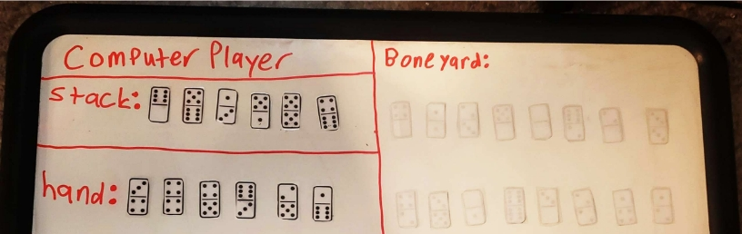

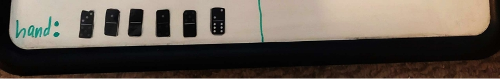

Real Life picture of Buildup Domino Game 

Note: it’s one of the few domino games that uses 2 different colored set of dominoes. 
## Build Up Domino (RULES OF THE GAME)
Build Up is a two-player dominoes game, designed by David Vander Ark.
### The Objective
The objective of this game is to score the highest after the final hand in a round.
### The Players
Two players play this game - one player will be the human user of the program, and the other player will be the program/computer. The two players will play a "tournament", consisting of one or more rounds. Each round will consist of the two players playing four hands, each hand consisting of 4-6 tiles.
### The Setup
The game uses two double-six sets. A double-six set contains 28 tiles. Each tile has two ends, each end containing 0-6 pips. The double-six set contains tiles with the following combination of pips:

0-0, 0-1, 0-2, 0-3, 0-4, 0-5, 0-6,

1-1, 1-2, 1-3, 1-4, 1-5, 1-6,

2-2, 2-3, 2-4, 2-5, 2-6,

3-3, 3-4, 3-5, 3-6,

4-4, 4-5, 4-6,

5-5, 5-6,

6-6.
#### Two such sets are used in the game - a white set used by the computer and a black set used by the human player. The two sets are shuffled before use.
Each player draws six tiles from the player's shuffled set and places them face up to constitute two rows of six tiles. The remaining tiles in each shuffled set form the boneyard for the respective player (black for human and white for computer).
### A Round
Each round consists of four hands. Six tiles each are used in the first three hands. The remaining 4 tiles are used in the last hand. For the first hand, in addition to the tile used to determine the first player, players draw five additional tiles from their boneyards. For subsequent hands, players draw the required number of tiles from the shuffled boneyard.
### First Player
Each player draws a tile from his/her boneyard. The player whose tile has the most pips plays first. If both the players have the same number of pips, the tiles are returned to the boneyards, the boneyards are shuffled and the process is repeated.
### A Hand
In each hand, the two players alternate placing one tile each, starting with the first player as determined above. The hand ends when both the players have placed all their tiles, or when neither player can place a tile. If one player cannot place a tile on his/her turn, the player will pass, allowing the other player to continue.
### Placement of a tile
A player places a tile from her/his hand on top of one of the twelve tile stacks started during setup, subject to the following rules:
- A non-double tile may be placed on any tile as long as the total number of pips on it is greater than or equal to that of the tile on which it is placed.
- A double tile (e.g., 0-0, 1-1, 2-2) may be placed on any non-double tile, even if the non-double tile has more pips.
- A double tile may be placed on another double tile only if it has more total pips than the tile on which it is placed.
### Score
When a hand ends, each player is awarded points as follows:
The points equal the total pips on all the tiles of the player's color that are on top of the twelve stacks.
If the player has any tiles that could not be placed, the total pips of these tiles is subtracted from the points. The tiles themselves are discarded, not returned to the boneyeard.
These points are added to the current score of the player. After the scores are updated, the next hand is started.
When the final hand ends, the player with the highest score wins the round. Ifboth the players have the same number of points, the round is a draw.
### The Tournament
After each round, the human player is asked whether she/he wants to play another round.
If yes, another round is played as described above and the process is repeated.
If no, the winner of the tournament is announced and the game quits. The winner of the tournament is the player who has won the most number of rounds. If both the players have won the same number of rounds, the tournament is a draw.
Ideally, players should try to place on top of their opponent's tiles rather than their own, so that more of their tiles will end up on top of stacks. But a player may choose to place on top of his/her own tile in order to play a tile that can otherwise not be played. Another way to play a tile that can otherwise not be played is to first place a low-valued double-tile on top of a high-valued tile.

## Bug Report 

The bugs detected include the location of the domino when listed in Help mode. When the domino location is listed in help mode, this may be incorrect. Another bug occurs sometimes when Human player goes back to back when scoring.  

Program execution 

This program was made using the Chipmunk Android Studio. The main executor is the Game.JAVA file. Any Android device running Android 7.0 (Nougat) or later (please note that if you do not have one you can use an emulator) will be able to run this game. All you have to do is go to settings, then about, and click on the build number 5-10 times. Finally, enable USB debugging. Now just plug your device into your computer and click run and you are all set. 
### Download the apk file in the repo and it should work assuming you are running android 7 (Nouget) or later
## Feature List 

- ### Missing Features 

 Help mode sometimes doesn’t choose non double tile when it has one double tile 

left. 

- ### Extra features  

 Clicked buttons have a red ripple effect to show what was clicked.

 Exit game button requires long press so user doesn’t accidently click on it.

## Data Structures Used 

- A vector of strings was the primary used data structure, and it was used for the following pieces: boneyard, hand, and stack. 
- A vector of Players was used in implementing the polymorphic behavior in the game. 

## Classes 

- ### Round class (Handles the player models of the GUI) 

This class is responsible for all information about a round including who won the 

round, who won the tournament, saving the game (SERIALIZATION of a tournament), who goes first, setting up the round, setting up the tournament and  the GUI for playing a round. 

Compositions: 

- player\_list: Vector of player pointers so that players can interact in the round polymorphically 
- ### Game class (Handles the start of the GUI) 

This class is responsible for running the entire game; everything from the 

welcome menu, playing a new game/tournament, and loading in a game from a serialization file. These are some of the key variables used within the class:

- player\_list: Vector of player pointers so that players can interact in the round polymorphically. 
  - memory: Vector of strings used for reading in a SERIALIZATION file at each line and storing them.
- ### Domino class 

This class is responsible for handling all of the domino capabilities such as stacks, 

boneyards, and hands. In addition, it handles subsequent functions like determining if the domino can be placed at a location, or determining the value of the domino e.g w34 = white 7 pip domino. It uses 4 important variables that play a HUGE role in Buildup:

- bone\_yard: Vector of strings used for holding the tiles in the boneyard
- stack: Vector of strings used for holding the tiles in the stack
- hand: Vector of strings used for holding the tiles in the hand
- selected\_bone: String is used for holding the domino that was selected 
- ### Player class  

This class is the base class for each player. It handles all of the important player 

abilities like being able to call all of the important domino functions as well as  functions like being able to tally score, make a move(polymorphic), and  determining the legal placement of a domino.

Compositions:

- Table: Domino object used for the player which is able to interact with said dominoes.
- ### Human class  

This class is one of the two derived classes of the player class. It provides its own 

input validation (user taps input based on button clicking) for selection and making a move (polymorphism). All of the functions are from the player class. 

- ### Computer class  

This class is one of the two derived classes of the player class. It provides its own 

input validation (computer generates its own input) for selection and making a move (polymorphism). Most of the functions are from the player class, but computer also has ai\_decison function used for coming up with the domino selection (POLYMORPHIC) and will always return 2 (make a move since computer will ALWAYS play to win).

## Log 

Since this project used a GUI, I completed this project twice; once in Eclipse (AKA ASCII) for the model M and again in Android for the view/controller VC to combine them to make an efficient MVC controlled program.  

- # ASCII: 

 3/13/2023 Created an Eclipse Hello World project and attempted to wrap 

my head around the general rules of how Java worked in syntax. 5 hours 

 3/14/2023-3/15/2023 Translated the Domino, Player, Human, and 

Computer files from C++ to JAVA  5 hours each day  

 3/16/2023 Translated remaining files and did extensive testing to verify 

correctness of model took a total of 8 hours 

- # GUI 

 3/17/2023 Created Hello World Android app and imported converted files 

to Android. Converted project and studied how Android programming works (messing around with different Android functions to get the hang of syntax). 8 hours 

 3/18/2023-3/21/2023 – Drew the GUI view via the xml files and was able 

to get the GUI to display the current state of the game (NOT INCLUDING AFTER MOVES AT THIS TIME).  Spent 4 hours each day 

 3/22/2023 Displays who goes first and why. 2 hours 

 3/23/2023-3/27/2023 Got the players to actually play (interacting with the 

(Round GUI)) and having the domino change its text and color to its new 

respective state to correctly match its model e.g: B06 on W05. 8 hours each day 

 3/28/2023 Players now alternate up until a hand is empty then terminates. 

5 hours 

 3/29/2023-3/30/2023 Hand refills with next set of dominoes and scores are calculated, and the next hand is played up until a winner of a round is announced.  

Finally, dominoes now display an actual face image instead of a ASCII value like “B00”. 10 hours each day 

 3/31/2023 Help mode works when its human’s turn and computer now 

explains why it did what it did. 5 hours 

 4/1/2023 Saving a game works correctly along with giving the option to 

play another round or ending the tournament and announcing the winner. 4 hours 

 4/2/2023 Loading in a game now works correctly along with displaying 

the game state when the first human boneyard tile  = computer’s first boneyard tile and telling the user in this instance it will reset. 3 hours 

 4/3/2023 Added in spinner menu for serialization for the user to be able to 

select the desired file along with cleaning up any detected issues. 4 hours 

 4/4/2023 Documented code and cleaned up and added on the finishing 

touches. 9 hours  

Screen shots 

1. Main Menu

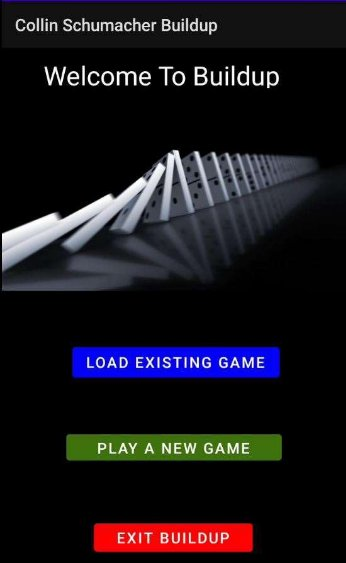

2. Round information so far

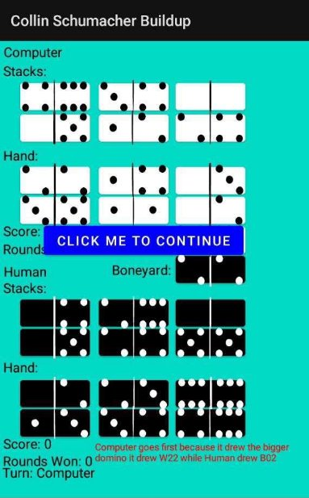

3. Computer player method

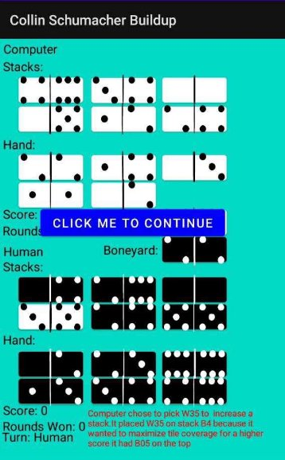

4. Help mode

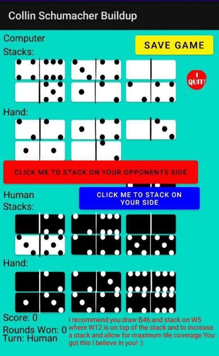

5. Human input for stacking opponent’s stack (B46 was the played tile) 

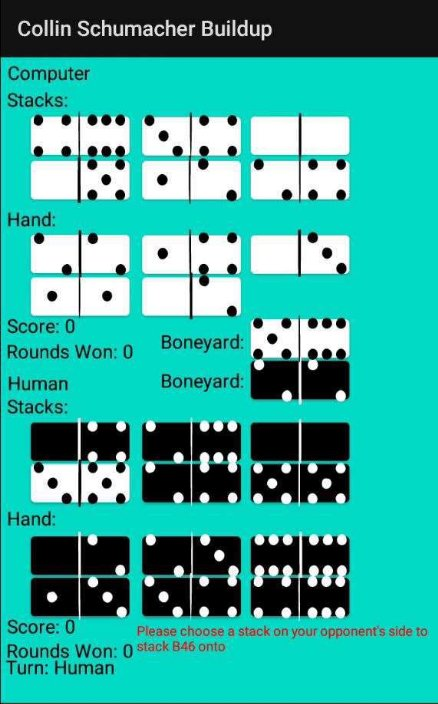

6. Human input for stacking on its own stack 

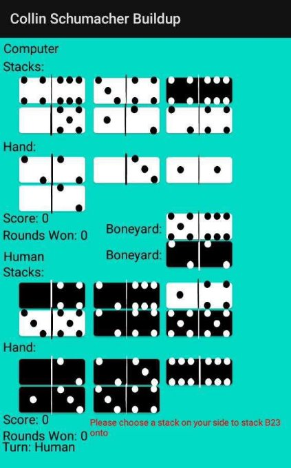

7. Save game 

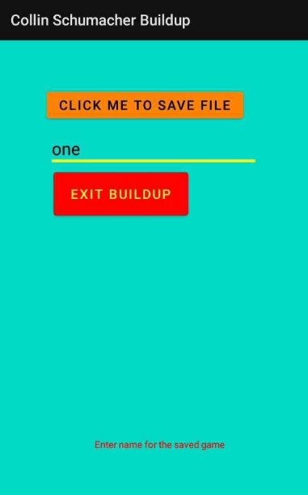

8. Load game 

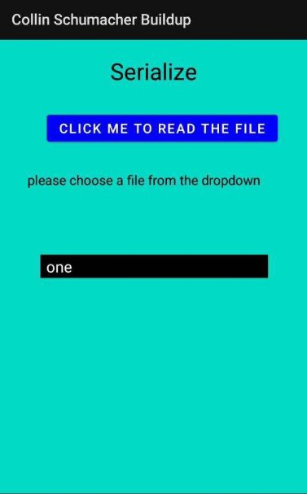

9. When Computer player can’t make any moves 

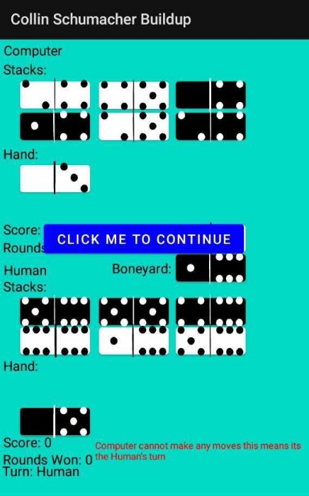

10. Which player won

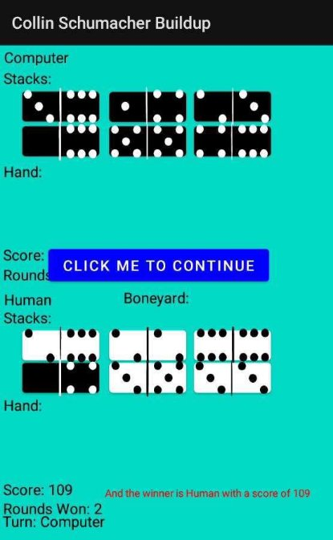

11. Which player won the tournament 

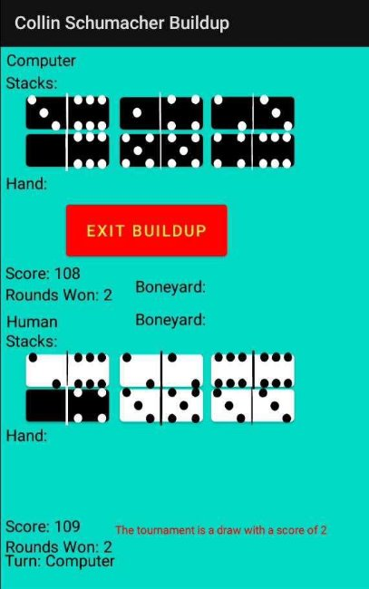
